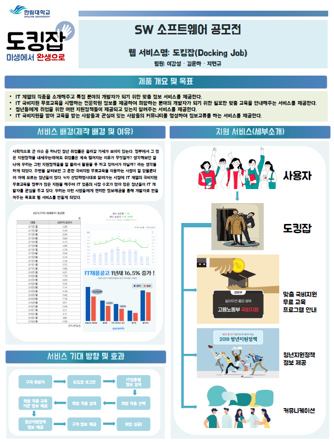
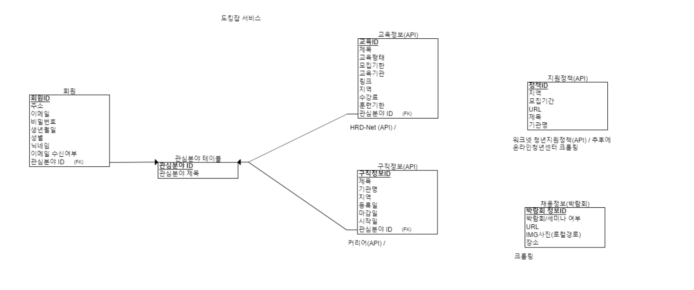

# 2019 2학기 웹프로그래밍 프로젝트
----
## 프로젝트명 : 도킹잡
### 12조 - 이갑성 김윤하 지현규
----
## 활동
#### 10월 21일
  1. 팀원 역할분배 및 아이디어 구상

    프론트:이갑성,지현규/벡엔드:김윤하

#### 10월 24일
  1. 지도교수 상담 및 아이디어 구체화

    기존 광범위한 직업분야를 IT분야로 축소

  2. 웹서비스를 위한 서버구축(Naver Cloud Platform)

[회의록1]

#### 10월 25일
  1. 한림대학교 SW WEEK 공모전 작품소개서 및 포스터 작성

  2. 서비스에 필요한 웹페이지 구상
  3. 프론트 작업부족으로 팀원 업무 재분담

    프론트:이갑성,지현규, 김윤하
    이갑성(my페이지, )
    지현규(main페이지, )
    김윤하(글쓰기페이지, )

[도킹잡 포스터]
  

#### 10월 27일
  1. DB설계
  2. 데이터수집을 위한 필요 API 검색 (클릭시 링크 URL)

  고용정보 : [HRD-NET 오픈API](http://www.hrd.go.kr/hrdp/ap/papao/PAPAO0100D.do)  
  구직정보 : [커리어](http://www.career.co.kr/api/)
  지원정책 : [워크넷 청년지원정책(API)](http://openapi.work.go.kr/opi/opi/opia/jynEmpSptList.do)
  지원정책 : [온라인청년센터(크롤링)](https://www.youthcenter.go.kr/main.do)
  채용정보(박람회) : 크롤링

[도킹잡 DB]

